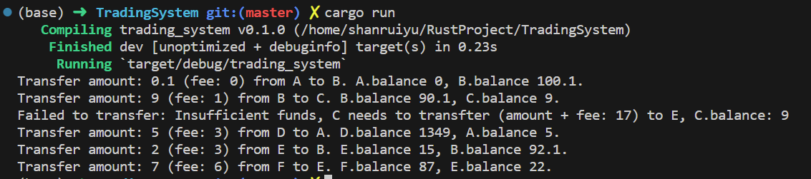

#  项目简介

本项目由Rust来编写。用`serde_json`实现json解析，利用`rayon`
提供的接口实现并发。  
相关版本：  
cargo 1.74.1 (ecb9851af 2023-10-18)  
rustup 1.26.0 (5af9b9484 2023-04-05)


## 运行代码

```shell
cargo run
```


## 单元测试
```shell
cargo test
```
在测试中主要测试了`transfer`函数的正确性。 单测代码位于`lib.rs`文件中。

## 代码解释
### 实体对象
#### Account
Account代表每个账户的信息。
```rust
pub struct Account {
    name: String,
    balance: Mutex<f64>,
}
```
#### System
System结构体包含了所有的请求内容和账户信息。在这个HashMap中，利用Mutex锁定Account结构体的
balance，实现更细粒度地锁定。每次转账只需锁定对应的转入和转出账户，不必锁定整个HashMap。
```rust
pub struct System {
    requests: Vec<Request>,
    accounts: HashMap<String, Arc<Account>>
}
```
#### Record / Request
Request和Record代表了每个交易请求以及其中的每条转账记录。
```rust
pub struct Record {
    from: String,
    to: String,
    amount: f64,
    fee: f64
}

pub struct Request {
    records: Vec<Record>    
}
```

### 核心代码
**lib.rs**  
`transfer`函数实现了两个账户间的转账逻辑。先尝试锁定两个账户，然后
对账户的余额进行修改。通过try_lock模式以及固定加锁顺序避免死锁。
```rust
fn transfer(from: &Arc<Account>, to: &Arc<Account>, amount: f64, fee: f64) -> Result<(), String> {
    let wait_duration = Duration::from_millis(100);

    loop {
        let (first, second) = if from.name < to.name { (from, to) } else {(to, from)};
        let try_lock_first = first.balance.try_lock();
        if try_lock_first.is_err() {
            std::thread::sleep(wait_duration);
            continue;
        }
        let try_lock_second = second.balance.try_lock();
        if try_lock_second.is_err() {
            std::thread::sleep(wait_duration);
            continue;
        }

        let (mut from_balance_guard, mut to_balance_guard) = if from.name < to.name { 
            (try_lock_first.unwrap(), try_lock_second.unwrap()) 
        } else { 
            (try_lock_second.unwrap(), try_lock_first.unwrap()) 
        };

        if *from_balance_guard < amount + fee {
            return Err(format!("Insufficient funds, {} needs to transfter (amount + fee: {}) to {}, {}.balance: {}", from.name, 
                amount + fee, to.name, from.name, from_balance_guard));
        }

        *from_balance_guard -= amount + fee;
        *to_balance_guard += amount;
        
        println!("Transfer amount: {} (fee: {}) from {} to {}. {}.balance {}, {}.balance {}.", amount, fee, from.name, to.name, from.name, 
            from_balance_guard, to.name, to_balance_guard);

        return Ok(())
    }
}
```

**main.rs**  
`read_json()`函数用于读取json文件，并生成新建System结构体所需的数据。
```rust
fn read_json() -> Result<(Accounts, Requests), Box<dyn Error>> {
    let account_data = fs::read_to_string("resources/accounts.json")?;

    let a: Accounts = serde_json::from_str(&account_data)?;
    
    let request_data = fs::read_to_string("resources/requests.json")?;

    let r: Requests = serde_json::from_str(&request_data)?;

    Ok((a, r))
}
```

## 数据
在这个项目中，我使用json格式作为数据源，存在TradingSystem/resources目录中。
有两个示例文件，分别是`accounts.json`和`requests.json`。
其中`accounts.json`代表系统中所有用户的账户，包括名称和余额。
`requests.json`代表所有的请求。
### 数据样例
accounts.json
```json
{
    "accounts": [
        {"name": "A", "balance": 0.1},
        {"name": "B", "balance": 100},
        {"name": "C", "balance": 0},
        {"name": "D", "balance": 1357},
        {"name": "E", "balance": 20},
        {"name": "F", "balance": 100},
        {"name": "System", "balance": 0}
    ]
}
```
requests.json
```json
{
    "requests": [
        {
            "records": [
                {"from": "A", "to": "B", "amount": 0.1, "fee": 0},
                {"from": "B", "to": "C", "amount": 9, "fee": 1},
                {"from": "C", "to": "E", "amount": 9, "fee": 8}
            ]
        },
        {
            "records": [
                {"from": "D", "to": "A", "amount": 5, "fee": 3},
                {"from": "E", "to": "B", "amount": 2, "fee": 3},
                {"from": "F", "to": "E", "amount": 7, "fee": 6}
            ]
        }
    ]
}
```

